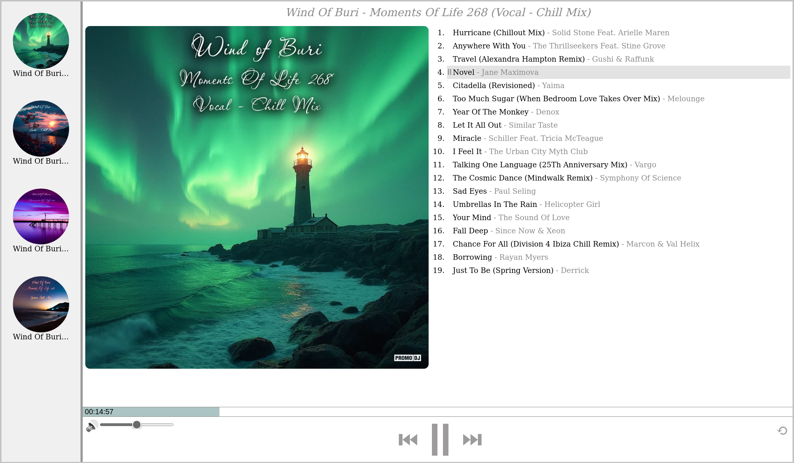

# promodj-player

## 🖼 Screenshot

## 🔗 [▶ Live demo](https://5en5e.github.io/promodj-player/)

---

## 📌 What it is
A web audio player that supports a tracklist within a single audio mix.
Allows playing individual tracks marked by timestamps.

---

## ⚙️ Features
- Select an album from a predefined list
- Select a track from the tracklist
- Play / Pause
- Skip to the next / previous track
- Adjust volume and mute
- Loop the current track
- Display playback progress
- Seek by clicking on the progress bar

---

## 🧠 How it works
- The configuration includes:
  - URL of the audio mix
  - A list of tracks with timestamps

- Playback uses the `HTMLAudioElement`

- Switching tracks is done by setting `audio.currentTime`

- UI synchronization with playback is handled via the `timeupdate` event:
  - Updates the progress bar
  - Determines the current active track

---

## ⚠️ Known issues
- `DOMException` appears in the console when switching tracks quickly
  (caused by the browser aborting the current audio loading when `currentTime` is changed)

- Poor UX on slow networks:
  the "playing" state is set immediately, but actual playback starts with a delay
  (can be improved by handling `canplay` / `loading` events and adding a loading indicator)

---

## 🚧 Future improvements
- Handle the issues mentioned above
- Refactor `main.js` into separate modules
- Add the ability to download individual tracks
- Display track time and title on hover over the progress bar
- Use semantic HTML tags
- Move logic from the DOM to JavaScript
- Auto-generate configuration from .cue files

---

## 🛠 Tech stack
- Vanilla JavaScript
- HTML
- CSS
